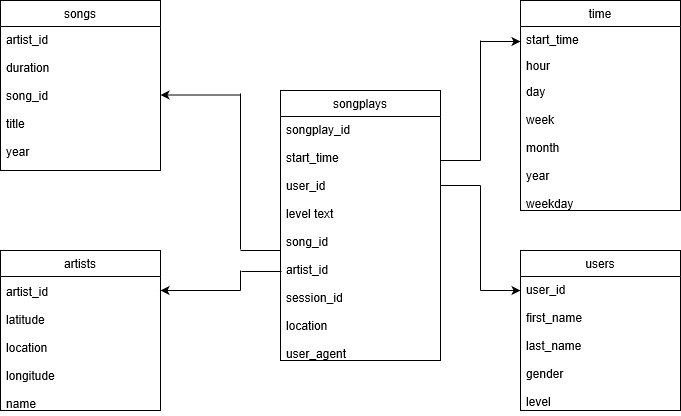

# Udacity Data Engineering Nanodegree Project

## Introduction

Sparkify is a streaming application.The analyticsdepartment is interested in understanding what is the most listened to ongs , their data is located in a directory of JSON logs on user activity on the appication, as well as a directory with JSON metadata on the songs in their application.

## Repositry Content 

* test.ipynb
* create_tables.py
* etl.ipynb
* etl.py
* sql_queries.py

## How to run the python scripts

To start a Python interactive session, type python in the command-line or terminal followed by your .py file name and press the ENTER key from the keyboard.

## Schema

